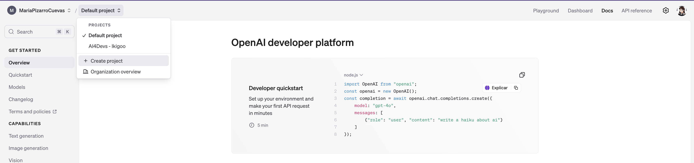
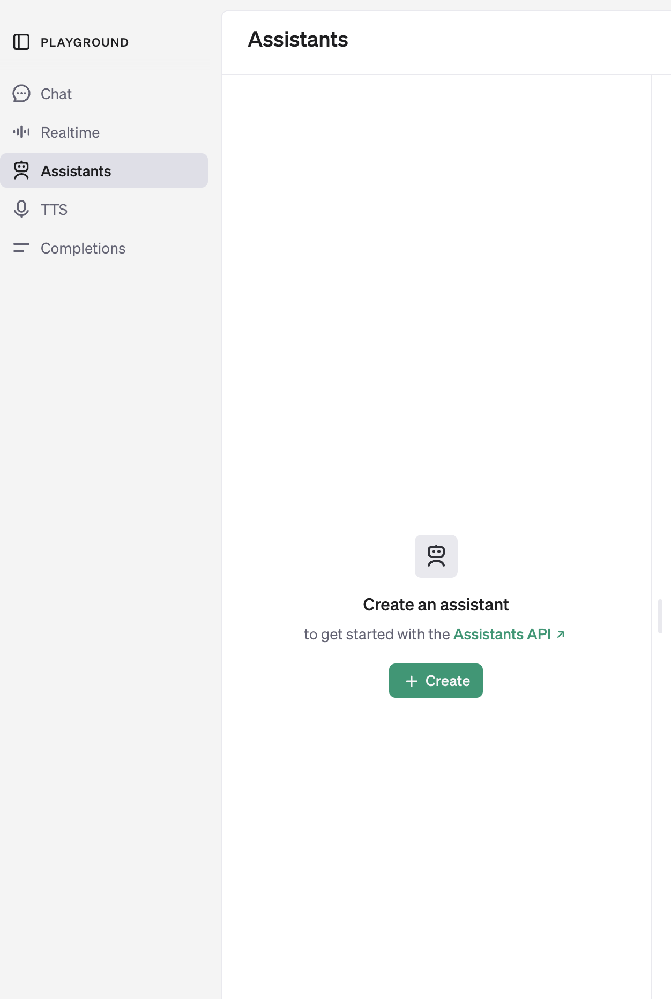
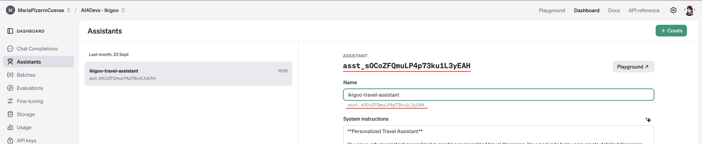
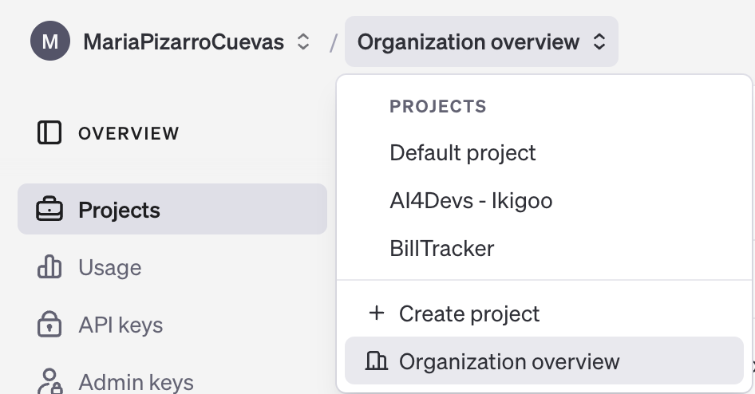
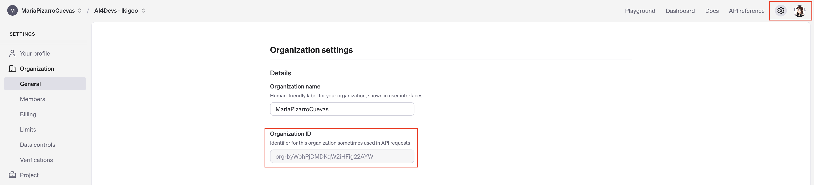
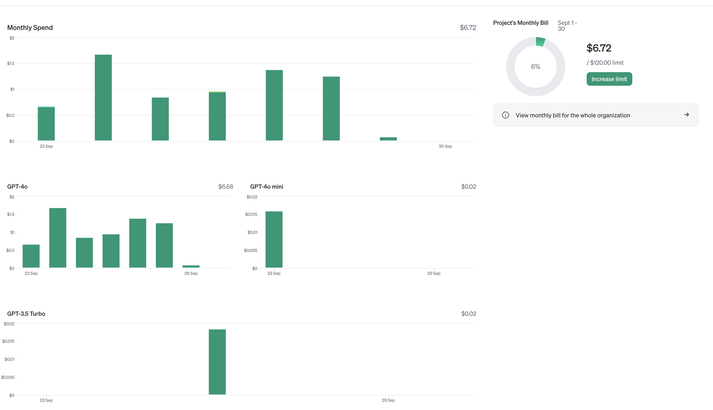

# AI4Devs - GPT Assistant Integration

## Contenido

- [AI4Devs - GPT Assistant Integration](#ai4devs---gpt-assistant-integration)
  - [Contenido](#contenido)
  - [Introducción](#introducción)
  - [Versión](#versión)
  - [Configuración del asistente customizado](#configuración-del-asistente-customizado)
    - [System Instructions:](#system-instructions)
    - [Model:](#model)
    - [Model Configuration](#model-configuration)
      - [Response Format:](#response-format)
      - [Temperature:](#temperature)
  - [Cómo integrar el asistente en tu aplicación:](#cómo-integrar-el-asistente-en-tu-aplicación)
  - [Caso de uso](#caso-de-uso)
    - [Costes](#costes)
  - [Referencias](#referencias)

## Introducción

Este proyecto es un ejemplo sencillo de cómo **_integrar un asistente GPT personalizado_** en una aplicación web, lo que nos permite a los desarrolladores agregar capacidades de conversación automatizada e interacción inteligente a sus plataformas.

La integración de un asistente GPT nos puede ayudar a abordar varias necesidades, como:

- **Interacción personalizada**: Los usuarios de hoy en día esperan experiencias que se ajusten a sus preferencias y necesidades específicas, como obtener recomendaciones, resolver dudas o recibir asistencia en tiempo real. La integración de un asistente inteligente permite una interacción dinámica y personalizada, aumentando la satisfacción del usuario al ofrecer respuestas y sugerencias precisas en función de sus solicitudes.

- **Automatización del soporte**: En plataformas con un gran volumen de usuarios, la automatización del soporte es clave para mantener la calidad sin aumentar costos. Un sistema de IA puede gestionar eficientemente una amplia gama de consultas, desde preguntas frecuentes hasta tareas repetitivas, lo que libera recursos humanos para centrarse en situaciones más complejas y de mayor valor.

- **Escalabilidad**: A medida que una aplicación o plataforma crece, es esencial que el soporte y la interacción con los usuarios puedan expandirse sin afectar el rendimiento. La inteligencia artificial facilita la escalabilidad al manejar múltiples interacciones simultáneas, proporcionando una asistencia rápida y eficaz sin sobrecargar los sistemas ni requerir más personal de soporte.

- **Mejora de la experiencia del usuario**: Además de resolver consultas, los asistentes virtuales pueden ser configurados para guiar a los usuarios a través de procesos complejos, sugerir opciones relevantes o facilitar la navegación en la plataforma. Este tipo de soporte proactivo y fluido contribuye significativamente a una experiencia de usuario más agradable y eficiente.

Este tipo de integraciones abren nuevas oportunidades para mejorar la interacción con nuestras aplicaciones, permitiendo ofrecer un valor añadido que las haga más atractivas y competitivas en el mercado actual.

## Versión

OpenAI-Beta: **assistants=v2**

Lanzamiento, abril 2024: _[platform.openai.com/docs/assistants/whats-new](https://platform.openai.com/docs/assistants/whats-new)_

## Configuración del asistente customizado

Accede a tu cuenta de OpenAI y crea un nuevo proyecto: [platform.openai.com/playground](https://platform.openai.com/playground)



Una vez dispongas de tu proyecto, accede a la sección de **Playground/Assistants** para crear tu nuevo asistente.



Dispondrás de varias propiedades para configurar tu asistente. En este tutorial nos centraremos en las siguientes secciones:

### System Instructions:

Indicaremos al asistente las instrucciones generales que debe seguir para responder a las consultas de los usuarios. Estas instrucciones deben ser claras y directas, proporcionando una guía clara para el comportamiento del asistente pero tenemos que tener en cuenta que, a mayor complejidad en las instrucciones, el asistente tardará más en responder. Lo adecuado es depurar el comportamiento del asistente para obtener el mejor resultado lo cual puedes hacer en la misma interfaz de configuración.

Un ejemplo de estructura para las instrucciones generales podría ser:

1. **Propósito General**
2. **Información Mínima Requerida**
3. **Información Adicional Opcional**
4. **Formato de la Respuesta**
5. **Flujo de Interacción**
6. **Estilo y Tono**
7. **Ejemplos de Uso**

Recuerda servirte de herramientas y métodos de estructuración de texto para que el asistente pueda interpretar correctamente las instrucciones, por ejemplo, puedes usar markdown o json para ello.

Los compañeros de GuruSup, por ejemplo, recomiendan utilizar XML en su vídeo: [🔥El FIN de las Alucinaciones en los LLM🔥 | Cómo aplicar los Prompts XML](https://www.youtube.com/watch?v=Whs0S2p8euA)

### Model:

Esta sección nos permite seleccionar el modelo de lenguaje que queremos que use nuestro asistente. El modelo elegido condicionará en gran medida la calidad de las respuestas que obtendremos en distintos niveles: velocidad, precisión y coste.

### Model Configuration

#### Response Format:

Con esta nueva versión de OpenAI Assistant API, podemos configurar el formato de respuesta del asistente, lo cual nos permite controlar si queremos que el asistente responda en texto plano como hace por defecto, con JSON a través de esta nueva propiedad o determinamos esta respuesta en el apartado **System Instructions**.

#### Temperature:

Con la propiedad **Temperature** podemos controlar la creatividad del asistente. Un valor de 0 hará que el asistente sea extremadamente preciso y conservador en sus respuestas, mientras que un valor superior puede hacer que el asistente sea más creativo y original. **_El nivel de temperatura ideal dependerá del objetivo que buscamos cubrir con nuestro asistente_**; para un asistente de soporte técnico puede ser interesante un valor bajo, mientras que para un asistente de recomendaciones puede ser interesante un valor más alto.

---

Dispones de más información para configurar tu asistente en la documentación oficial de OpenAI: 

- [platform.openai.com/docs/api-reference/assistants](https://platform.openai.com/docs/api-reference/assistants)
- [platform.openai.com/docs/assistants/tools](https://platform.openai.com/docs/assistants/tools)

## Cómo integrar el asistente en tu aplicación:

Ahora que disponemos de nuestro asistente configurado, podemos integrarlo en nuestra aplicación. Para ello, necesitaremos:

1. Crear una API Key: 
   - Accederemos a esta sección desde **[Dashboard/API Keys](https://platform.openai.com/api-keys)**

2. Obtener el ID de nuestro asistente:
   - Disponemos de este ID en varios puntos de nuestra interfaz de configuración, por ejemplo, en la sección de **[Dashboard/Assistants](https://platform.openai.com/assistants)**:
     

3. Obtener el ID de nuestro proyecto:
   - Accederemos a esta sección desde **[Organization Overview/Projects](https://platform.openai.com/organization/projects)**
     

4. Obtener el ID de nuestra organización:
   - Accederemos a esta sección desde **[Settings/Organization/General](https://platform.openai.com/settings/organization/general)**
     

5. Utilizar el ID de nuestro asistente para crear un hilo de conversación y obtener el ID del hilo e iterar sobre el hilo para enviar mensajes al asistente (ejemplo en Node.js):
    ```js
    import OpenAI from "openai";

    async function main() {
        const openAIClient = new OpenAI({
            apiKey: {OUR_API_KEY},
            organization: {OUR_ORGANIZATION_ID},
            project: {OUR_PROJECT_ID},
        });

        const thread = await openAIClient.beta.threads.create();

        const message = await openAIClient.beta.threads.messages.create(
            thread.id,
            {
                role: "user",
                content: {USER_MESSAGE}
            }
        );

        const run = await openAIClient.beta.threads.runs.createAndPoll(
            thread.id,
            {
                assistant_id: {OUR_ASSISTANT_ID}  
            }
        );

        // Iteramos sobre el hilo para obtener/mostrar las respuestas del asistente
        if (run.status === 'completed') {
            const messages = await openAIClient.beta.threads.messages.list(run.thread_id);
            for (const message of messages.data.reverse()) {
                console.log(`${message.role} > ${message.content[0].text.value}`);
            }
        } else {
            console.log(run.status);
        }
    }

    main();
    ```

Para los ejemplos de código se ha tomado como referencia la [integración del asistente de forma asíncrona](https://platform.openai.com/docs/assistants/quickstart?context=without-streaming) pero esto dependerá de lo que necesites en tu caso particular.

## Caso de uso

Esta modalidad de customización se ha utilizado para uno de los proyectos finales de AI4Devs, en el cual se ha configurado un asistente personalizado para generar itinerarios de viaje a través de un chatbot.

Compartimos con vosotros las instrucciones finales del asistente y cómo se configuró la respuesta del mismo para facilitar el trabajo posterior de desarrollo y almacenamiento de la información.

- [Instrucciones del asistente](./docs/instructions.md)
- [Configuración de la respuesta del asistente](./docs/real-response-example.md)

### Costes

Para poder visualizar los costes de utilizar un asistente personalizado, OpenAI nos ofrece una herramienta en la sección de **[Dashboard/Usage](https://platform.openai.com/usage)**.

Para este aplicativo en particular, donde se utilizaron varios modelos hasta dar con el idóneo y el tiempo de desarrollo se extendió durante unas pocas semanas, el consumo medio fue de 150.000 tokens, unas 70 requests diarias, lo que se tradujo en un coste total de $6.72.


 
## Referencias

- [API Overview | platform.openai.com/docs/overview](https://platform.openai.com/docs/overview)
- [Assistants Creation | platform.openai.com/docs/assistants/overview](https://platform.openai.com/docs/assistants/overview)
- [Assistants Integration | platform.openai.com/docs/assistants/quickstart](https://platform.openai.com/docs/assistants/quickstart)
